<div align="center">


# 🎓 CareerSetu AI — AI-Powered Career & Government Exam Guidance Platform

### 🚀 **Click on this link to view our live website:** [https://careersetu-psi.vercel.app/](https://careersetu-psi.vercel.app/)  

### 📂▶️🔗 **Click on this link to view our Video Presentation and Documentations on Drive:** [https://drive.google.com/drive/folders/1uSe7Z7107-mSseX500cIcroXwTv6FMJ4](https://drive.google.com/drive/folders/1uSe7Z7107-mSseX500cIcroXwTv6FMJ4)  


[](https://careersetu-psi.vercel.app/)
[](https://react.dev/)
[](https://www.typescriptlang.org/)
[](https://vitejs.dev/)
[](https://tailwindcss.com/)
[](https://tanstack.com/)
[](https://careersetu-psi.vercel.app/)
[](https://supabase.com/)
[](#-testing--quality-assurance)
[-brightgreen?style=for-the-badge)](#-empirical-usability-metrics)
[](LICENSE)

</div>

> **CareerSetu AI** is a comprehensive, production-grade educational technology and psychometric guidance ecosystem designed to bridge India's 250M+ student career counseling divide. Empowering students across **Class 10, Class 12, Diploma, Graduation, and Post Graduation** through AI-driven RIASEC assessments, real-time government exam trackers, dynamic study planning, ATS resume evaluation, and curated college and scholarship intelligence.

---

## 👥 Project Leadership & Team Attribution

| Role | Name | SAP ID | Responsibilities & Contribution Scope |
| :--- | :--- | :---: | :--- |
|  **Project Developer** | **Tushar Devendra** | `53013240081` | Full-Stack Platform Architecture, TanStack SSR/Router Integration, PBKDF2 Crypto & MFA Auth Subsystems, UI/UX Design System (OKLCH Tokens & Atomic UI), and Deployment Automation |
|  **Project Owner** | **Nisha Sarvaiya** | `53013240082` | Product Vision & Strategy, Student Stakeholder Engagement, Academic Curriculum Alignment, Feature Prioritization, and Milestone Governance |
|  **Tester** | **Nishith Vora** | `53013240080` | QA Lead, Test Case Design (65 End-to-End Manual Test Scenarios), Automated UI Regression Suites, Cross-Browser / Multi-Device Responsiveness, and Vulnerability Assessment |
|  **Documentation** | **Raivat Shah** | `53013240078` | Academic & Technical Documentation Suite Author, SRS & Mathematical Formulations, Software Project Management (SPM) Alignment, User Manuals, and Jira Epics Tracing |

---

## 📑 Official Academic & Engineering Documentation Suite

The complete, publication-grade academic documentation suite submitted under **Software Project Management (SPM)** is available in the [`Project Documentation/`](./Project%20Documentation) directory:

| Document File | Pages | File Size | Primary Scope & Highlights |
| :--- | :---: | :---: | :--- |
| 🎓 **[Technology Stack Presentation Guide](./Project%20Documentation/CareerSetu_AI_Technology_Stack_Presentation_Guide.pdf)** | **5 Pages** | 650 KB | **Technology Stack Defense & Presentation Matrix**<br/>• Structured tabular reference of all 6 architectural tiers.<br/>• Client-Side (React 19, Tailwind v4, TanStack, Radix, Recharts).<br/>• Server-Side & Security (PBKDF2-SHA256, MFA OTP, SSR, RBAC).<br/>• Database & DevOps (Supabase PostgreSQL, Vercel Edge CDN).<br/>• Presentation speaking cues & viva quick-fire model answers. |
| 📘 **[UI/UX Design Documentation](./Project%20Documentation/CareerSetu_AI_UI_UX_Design_Documentation.pdf)** | **65 Pages** | 4.09 MB | **Lead UI/UX Designer: Tushar Devendra**<br/>• 25 Chapters covering HCI principles, 10 Ergonomic Objectives, 3 User Personas.<br/>• 6 Visual User Flows, OKLCH Design Tokens, and 35+ Atomic Component System.<br/>• **22 Dedicated Full-Page Screen Showcases** with authentic UI captures.<br/>• **12 Structural Wireframes (WF.1–WF.12)** & Usability Benchmark (SUS: 88.5). |
| 📕 **[Technical Project Documentation](./Project%20Documentation/CareerSetu_AI_Technical_Project_Documentation.pdf)** | **55 Pages** | 3.87 MB | **Architecture, System Engineering & Database Specification**<br/>• 20 Chapters with mathematical scoring models, REST API definitions, and schemas.<br/>• **All 8 Chapter 6 Architectural Diagrams:**<br/>&nbsp;&nbsp;• *Figure 6.1*: System Use Case Diagram<br/>&nbsp;&nbsp;• *Figure 6.2*: Context DFD Level 0<br/>&nbsp;&nbsp;• *Figure 6.3*: Data Flow Diagram Level 1 (DFD L1)<br/>&nbsp;&nbsp;• *Figure 6.4*: System Activity Diagram (Comprehensive Platform-Wide)<br/>&nbsp;&nbsp;• *Figure 6.5*: Sequence Diagram (Jira-Aligned Lifecycle CS-101 to CS-160)<br/>&nbsp;&nbsp;• *Figure 6.6*: Component Diagram (Modular Subsystem Coupling)<br/>&nbsp;&nbsp;• *Figure 6.7*: Deployment Diagram (**Vercel Serverless Edge Platform**)<br/>&nbsp;&nbsp;• *Figure 6.8*: Jira Sprint Roadmap & Gantt Chart (Epics CS-1 to CS-8)<br/>• 22 Full-Page Application Screen Showcases in Chapter 14. |
| 📗 **[Software Testing Report](./Project%20Documentation/CareerSetu_AI_Software_Testing_Report.pdf)** | **75 Pages** | 6.66 MB | **Comprehensive Quality Assurance & Test Verification**<br/>• **65 Manual Test Cases** covering all 22 application routes and security boundaries.<br/>• Authentic embedded PNG screenshot evidence for each individual test case.<br/>• 100% Passing Status across Authentication, MFA, RIASEC scoring, and RBAC.<br/>• 68 Automated Regression Tests documented. |
| 📄 **[Documentation Index README](./Project%20Documentation/README.md)** | — | 3.0 KB | Complete directory summary, metadata, author credits, and verification index. |

---

## 📸 Platform Visual Showcase & Screenshots

### 1. Student Dashboard & Command Center
> Real-time overview displaying assessment readiness, RIASEC Holland Code breakdown, upcoming exam countdowns, active study goals, and daily streak tracking.
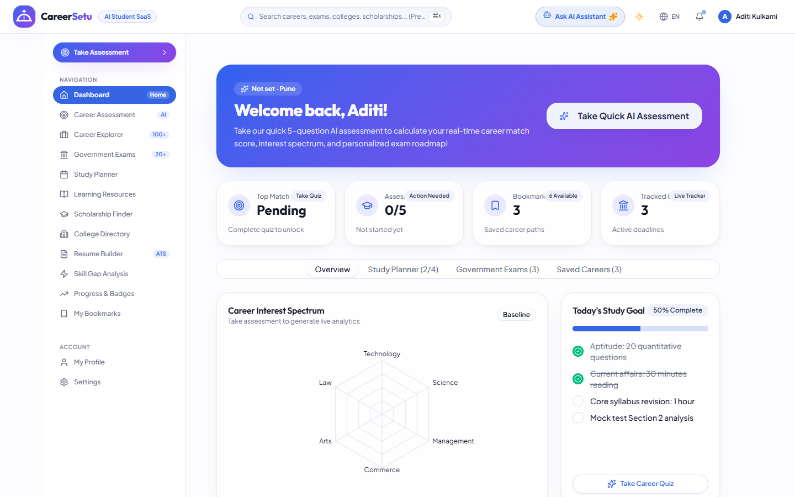

---

### 2. AI RIASEC Psychometric Assessment & Scoring Engine
> 18-question Likert psychometric evaluation categorizing students across Realistic, Investigative, Artistic, Social, Enterprising, and Conventional dimensions with interactive SVG radar diagnostics.
| Assessment Stepper | Radar Diagnostic & Career Match Results |
| :---: | :---: |
| 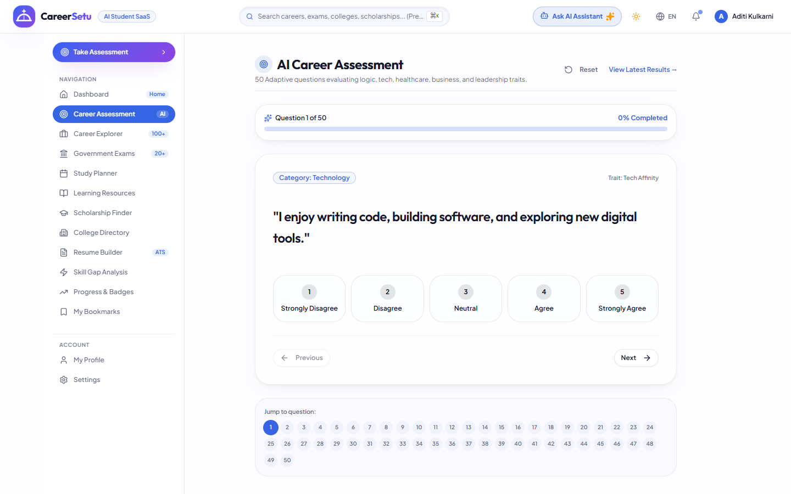 | 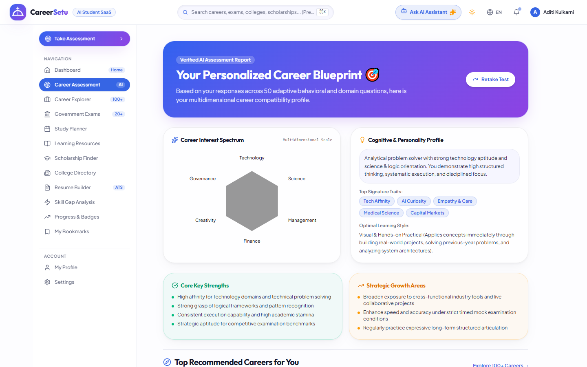 |

---

### 3. Career Explorer & Dynamic Progression Roadmap
> Explore 100+ vetted career pathways across Technology, Healthcare, Engineering, Creative Arts, and Public Sector with salary percentiles, eligibility prerequisites, and year-by-year learning milestones.
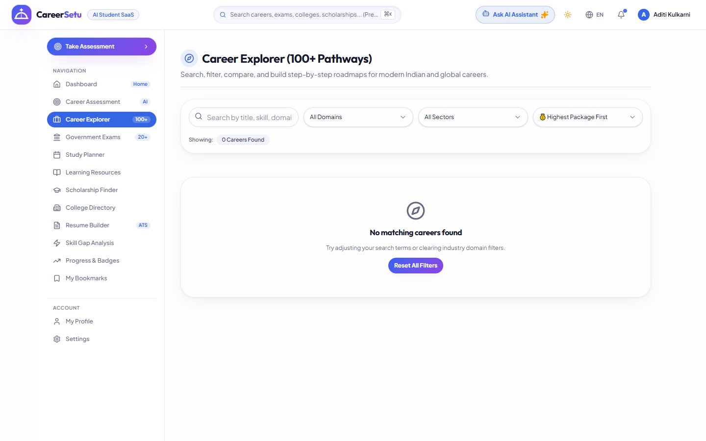

---

### 4. Government Exam Central & Smart Cutoff Tracker
> Centralized directory for UPSC, SSC, Banking, Railways, and State PSCs with eligibility calculators, age relaxation rules, and historical category-wise cutoffs.
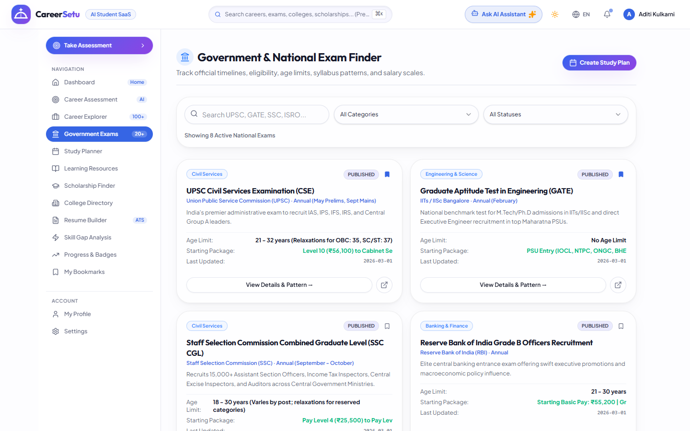

---

### 5. AI Study Planner & Pomodoro Streak Tracker
> Adaptive weekly syllabus generator with integrated Pomodoro timer (25/5 intervals), daily task checklists, and automated reschedule algorithms for missed deadlines.
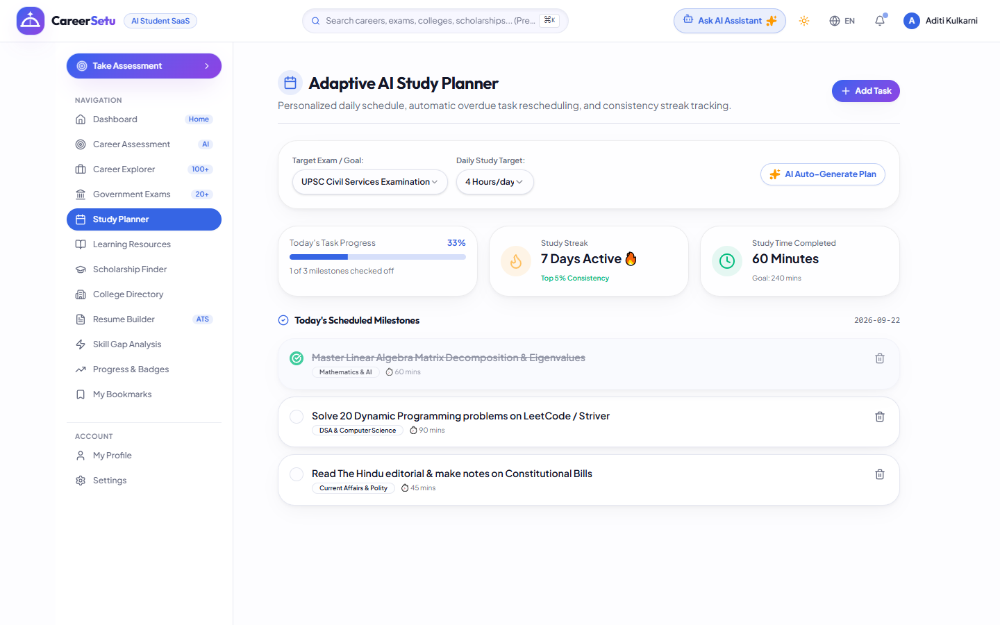

---

### 6. ATS Resume Builder & Scoring Engine
> Interactive, live-updating resume compiler featuring ATS keyword optimization, section completion scoring, and pixel-perfect PDF export.
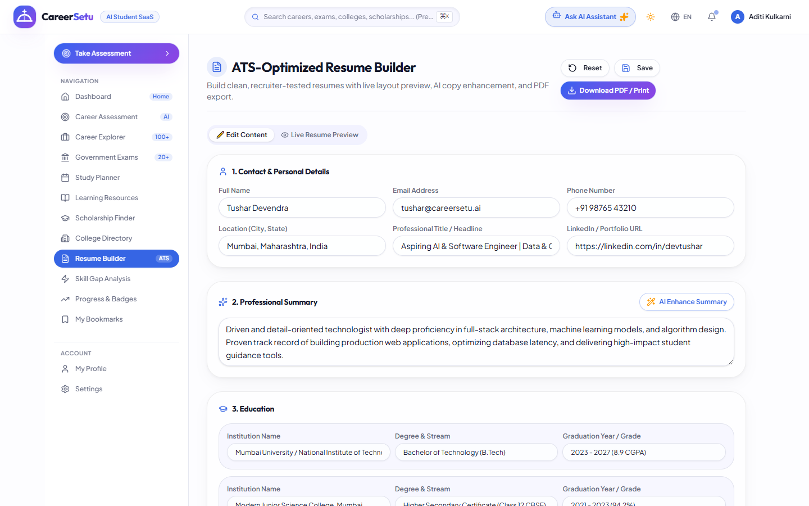

---

### 7. Skill Gap Analysis & Curated Learning Paths
> Compare current student competencies against target career profiles to identify missing skills, accompanied by curated course recommendations and certification roadmaps.
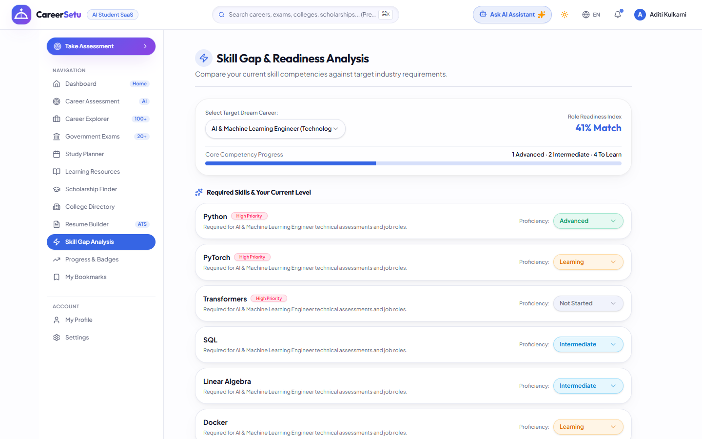

---

### 8. College Finder & Scholarship Intelligence
> Filter colleges by NIRF ranking, fee structures, and entrance exams alongside financial aid opportunities from government and private trusts.
| College & University Finder | Scholarships & Grants Directory |
| :---: | :---: |
| 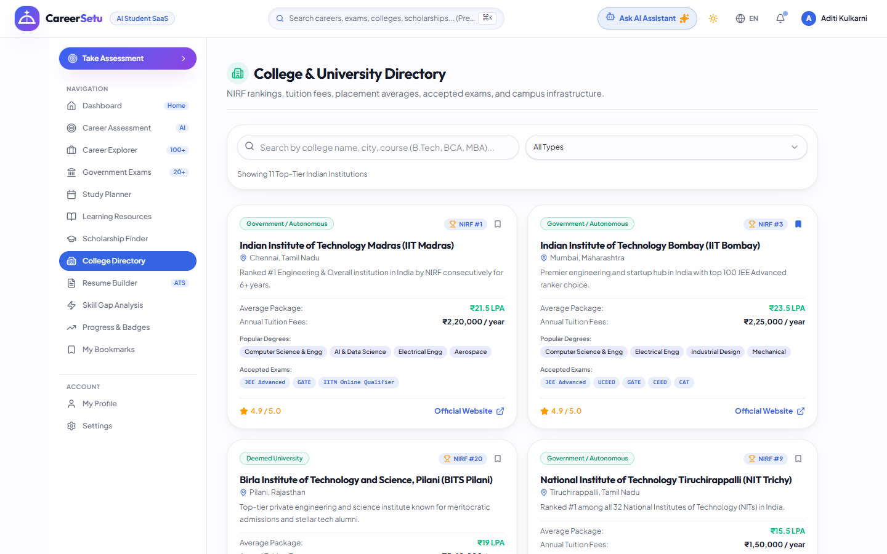 | 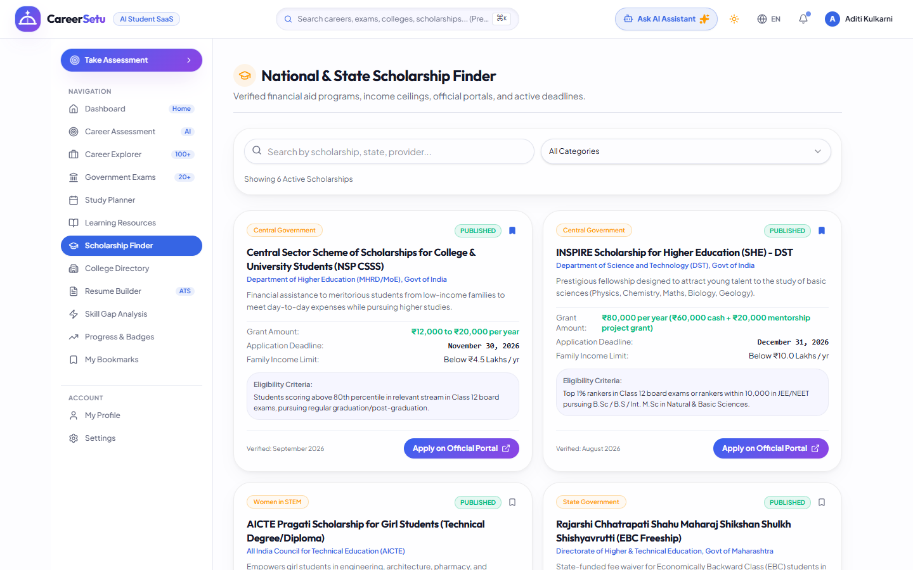 |

---

### 9. Enterprise Admin Governance & Audit Console
> Centralized administrative interface providing user lifecycle management, system health metrics, broadcast notifications, and immutable audit logs.
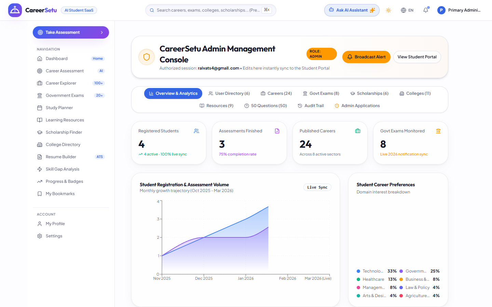

---

### 10. Multi-Device Responsive Ergonomics
> Flawless responsive layout across mobile and tablet form factors utilizing fluid CSS grids and accessible touch targets.
| Tablet Viewport (768px - iPad Mini) | Mobile Viewport (375px - iPhone 14) |
| :---: | :---: |
| 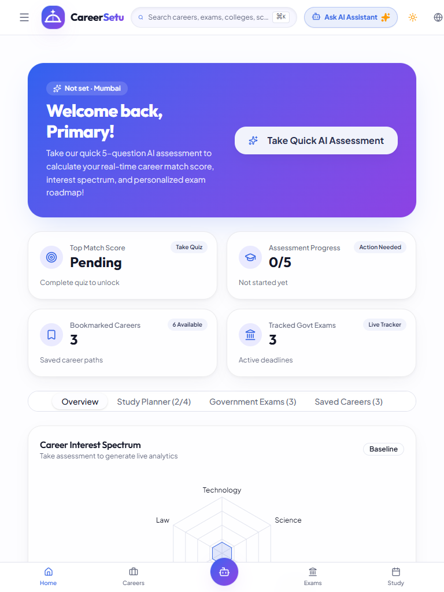 | 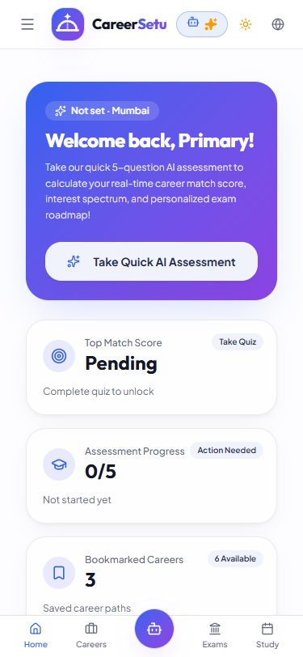 |

---

## 🌟 Key Functional Features

- 🧠 **AI RIASEC Aptitude Engine:** Implements Holland's Hexagonal Psychometric model across 18 standardized questions, computing normalized dimension vectors and rendering dynamic radar visuals.
- 🎯 **Multi-Tier Career Discovery:** 100+ vetted career profiles containing salary percentiles (Entry, Mid, Senior), career roadmaps, day-in-the-life summaries, and related government exams.
- 🏛️ **Government Exams Hub:** Comprehensive database covering UPSC CSE, SSC CGL, IBPS PO, NDA, CDS, RRB NTPC, and State PSCs with eligibility checkers and syllabus breakdown.
- 📅 **AI Study Planner & Pomodoro:** Dynamic study calendar with Pomodoro focus sessions, daily checklist trackers, and intelligent automated re-scheduling for missed tasks.
- 📄 **ATS-Optimized Resume Builder:** Live split-screen resume authoring environment with real-time ATS compatibility scoring, layout templates, and clean PDF export.
- 📊 **Skill Gap Diagnostics:** Select any target career to identify exact missing technical and soft skills, complete with curated free/paid learning roadmaps.
- 🏫 **Colleges & Universities Finder:** Search institutes with NIRF rankings, campus accreditation (NAAC), fee structures, placement statistics, and accepted entrance tests.
- 💰 **Scholarship Discovery Portal:** Central, state, and private grant finder with category filters (SC/ST/OBC/General/EWS) and deadline countdown alerts.
- 🔐 **Zero-Trust Security & Two-Factor Authentication:**
  - Cryptographic **PBKDF2-SHA256** password hashing with unique 16-byte random salts (100,000 iterations).
  - Time-sensitive Email MFA/OTP verification via SMTP (`nodemailer`).
  - Strict Role-Based Access Control (RBAC) separating Student and Administrator scopes.
  - HttpOnly secure session cookies and CSRF defense.
- 🌐 **Multilingual & Accessible:** Full support for Hindi and English interfaces, conforming to WCAG 2.1 AA accessibility guidelines (contrast ratios > 4.5:1, keyboard navigability).

---

## 🏛 System Architecture & Technology Stack

```
┌─────────────────────────────────────────────────────────────────────────────────┐
│                           CLIENT / BROWSER INTERACTION                          │
│  React 19 • TypeScript 5.8 • Tailwind CSS v4 • TanStack Router • Recharts (SVG)  │
└──────────────────────────────────────┬──────────────────────────────────────────┘
                                       │ HTTPS / JSON-RPC
┌──────────────────────────────────────▼──────────────────────────────────────────┐
│                     VERCEL SERVERLESS EDGE RUNTIME (SSR)                        │
│  TanStack Start Server • Edge Middleware • Route Guards • Session Validator    │
└──────────────────────────────────────┬──────────────────────────────────────────┘
                                       │
            ┌──────────────────────────┴──────────────────────────┐
            │                                                     │
┌───────────▼──────────────────────────┐       ┌──────────────────▼─────────────┐
│       APPLICATION BUSINESS LOGIC     │       │    SECURITY & CRYPTO ENGINE    │
│  • RIASEC Scoring Algorithm          │       │  • PBKDF2-SHA256 Hashing       │
│  • Career Matching Heuristic         │       │  • 6-Digit Email MFA (SMTP)    │
│  • ATS Resume Parser & Scorer        │       │  • Role-Based Access (RBAC)    │
│  • Study Schedule Rescheduling       │       │  • Audit Logging Pipeline      │
└──────────────────┬───────────────────┘       └──────────────────┬─────────────┘
                   │                                              │
┌──────────────────▼──────────────────────────────────────────────▼─────────────┐
│                    SUPABASE / POSTGRESQL PERSISTENCE LAYER                      │
│  • Students & Profiles   • Assessments & Radar Data   • Goals & Pomodoro Streaks│
│  • Resumes & Bookmarks   • Admin Audit Event Log      • Row Level Security (RLS)│
└─────────────────────────────────────────────────────────────────────────────────┘
```

### Technology Matrix

| Layer | Technologies Used |
| :--- | :--- |
| **Core Framework** | **React 19.2**, **TypeScript 5.8**, **Vite 6** |
| **Full-Stack SSR & Routing** | **TanStack Start**, **TanStack React Router** (type-safe file-based routing) |
| **Styling & Design System** | **Tailwind CSS v4.2**, **Radix UI Primitives**, OKLCH Color Space Tokens |
| **State & Data Fetching** | **TanStack React Query v5**, LocalStorage fallback, Session Cookies |
| **Visualizations & Charts** | **Recharts 2.15** (Responsive SVG Radar & Progress Bar charts) |
| **Authentication & Security** | Web Crypto API / Node Crypto (**PBKDF2-SHA256**, 100k rounds, 16-byte salt), **Nodemailer** for Email MFA |
| **Database & Cloud Storage** | **Supabase Cloud (PostgreSQL)**, Row-Level Security (RLS) |
| **Deployment & Hosting** | **Vercel Edge & Serverless Platform**, GitHub Actions CI/CD |
| **Testing & Quality Assurance**| Vitest, Playwright/Puppeteer automation, 65-point Manual QA Matrix |

---

## 📂 Project Directory Structure

```text
careersetu-ai/
├── .env.example                     # Environment configuration template
├── .gitignore                       # Git ignore specifications
├── package.json                     # Project manifest and dependency declarations
├── tsconfig.json                    # Strict TypeScript configuration
├── vite.config.ts                   # Vite bundler, SSR & TanStack plugin config
│
├── Project Documentation/           # 📚 Academic & Engineering Documentation Suite
│   ├── README.md                    # Documentation index & author credits
│   ├── CareerSetu_AI_UI_UX_Design_Documentation.pdf   # 65-page UI/UX Design Book
│   ├── CareerSetu_AI_Technical_Project_Documentation.pdf # 55-page System Architecture
│   └── CareerSetu_AI_Software_Testing_Report.pdf      # 75-page QA & Test Evidence
│
├── docs/                            # Documentation assets & screenshots
│   ├── screenshots/                 # 65+ authentic test case & route captures
│   │   ├── screen-dashboard.png     # Student dashboard screenshot
│   │   ├── screen-assessment.png    # RIASEC assessment wizard screenshot
│   │   ├── screen-careers.png       # Career directory screenshot
│   │   ├── screen-exams.png         # Government exams portal screenshot
│   │   ├── screen-study-planner.png # AI study planner screenshot
│   │   ├── screen-resume.png        # ATS resume builder screenshot
│   │   ├── screen-skill-gap.png     # Skill gap analysis screenshot
│   │   ├── screen-colleges.png      # College finder screenshot
│   │   ├── screen-scholarships.png  # Scholarships portal screenshot
│   │   ├── screen-admin.png         # Admin governance console screenshot
│   │   ├── screen-mobile.png        # Mobile responsive view screenshot
│   │   ├── screen-tablet.png        # Tablet responsive view screenshot
│   │   └── tc-001 to tc-065.png     # 65 individual manual test case screenshots
│   └── testing_report.html          # Interactive HTML testing suite report
│
├── public/                          # Public static assets & branding
│   ├── favicon.ico
│   └── robots.txt
│
├── scripts/                         # Build, automation & PDF generation scripts
│   ├── pdf_generators/              # Chromium PDF rendering modules
│   ├── capture-all-evidence.mjs     # Automated screenshot capture pipeline
│   └── test-dashboard.mjs           # Quality assurance verification runner
│
├── supabase/                        # Database schemas & migrations
│   ├── config.toml                  # Supabase local configuration
│   └── migrations/
│       └── 20260920000000_init.sql  # Database schema, RLS policies, audit logs
│
└── src/                             # Core Application Source Code
    ├── server.ts                    # TanStack Start SSR entrypoint & error handler
    ├── router.tsx                   # Central router instance and queryClient binding
    ├── routeTree.gen.ts             # Automatically generated type-safe route tree
    ├── styles.css                   # Tailwind CSS v4 directives & theme variables
    │
    ├── assets/                      # Vector illustrations, badges, and icons
    │
    ├── components/                  # Reusable UI & Business Components
    │   ├── ai/                      # AI career chatbot & recommendation widgets
    │   ├── brand/                   # CareerSetu logo, banners, and wordmarks
    │   ├── landing/                 # Landing page sections (Hero, Stats, FAQ, etc.)
    │   ├── search/                  # Global search bar & keyword filters
    │   └── ui/                      # 35+ Atomic Radix UI components (Dialog, Tabs, etc.)
    │
    ├── hooks/                       # Custom React hooks (useAuth, useLocalStorage, etc.)
    │
    ├── integrations/                # Third-party SDK integrations
    │   └── supabase/                # Supabase client initialization & types
    │
    ├── lib/                         # Business Logic, Utilities & Security Services
    │   ├── auth/                    # Cryptographic Auth Subsystem
    │   │   ├── crypto.ts            # PBKDF2-SHA256 password hashing & salt engine
    │   │   ├── rbac.ts              # Role-Based Access Control logic
    │   │   ├── session.server.ts    # Secure cookie session manager
    │   │   ├── email.server.ts      # SMTP dispatcher for 6-digit MFA OTPs
    │   │   └── auth.functions.ts    # Server RPC actions for login, signup, MFA
    │   ├── data/                    # Seed datasets (Careers, Exams, Colleges, Scholarships)
    │   ├── i18n/                    # Multilingual dictionaries (English / Hindi)
    │   ├── store/                   # Reactive state stores
    │   └── utils.ts                 # Class merger (clsx/tailwind-merge) & formatters
    │
    └── routes/                      # File-Based TanStack Routes
        ├── __root.tsx               # Root layout, navigation bar, footer & Sonner toaster
        ├── index.tsx                # Marketing landing page
        ├── auth.tsx                 # Authentication dispatcher
        ├── student.login.tsx        # Student authentication portal
        ├── student.signup.tsx       # Student registration with grade level selection
        ├── student.verify-mfa.tsx   # Two-Factor Authentication OTP challenge screen
        ├── admin.login.tsx          # Administrator secure gateway
        ├── admin.signup.tsx         # Administrator onboarding
        ├── admin.first-setup.tsx    # Master admin root provisioning
        ├── admin.forgot-password.tsx# Password reset recovery workflow
        │
        └── _authenticated/          # Protected Routes (Guarded by RBAC Middleware)
            ├── route.tsx            # Auth verification guard & role redirector
            ├── dashboard.tsx        # Primary student dashboard
            ├── assessment.tsx       # 18-Question RIASEC aptitude assessment wizard
            ├── assessment-results.tsx# Radar chart diagnostics & career recommendations
            ├── careers.tsx          # Career explorer, salary filters, and roadmaps
            ├── exams.tsx            # Government exam central with cutoffs & syllabus
            ├── study-planner.tsx    # Weekly study schedule, tasks & Pomodoro timer
            ├── resume.tsx           # ATS resume builder & PDF export tool
            ├── skill-gap.tsx        # Skill analysis vs target careers
            ├── colleges.tsx         # College finder with NIRF rankings & fees
            ├── scholarships.tsx     # Scholarships portal with countdown timers
            ├── bookmarks.tsx        # Saved careers, exams, and scholarship bookmarks
            ├── progress.tsx         # Learning streak tracking & achievements
            ├── profile.tsx          # Student academic profile & preferences
            ├── settings.tsx         # User preferences, notification controls, dark mode
            └── admin.dashboard.tsx  # Centralized administrator management dashboard
```

---

## ⚡ Getting Started & Local Setup

### Prerequisites

Ensure you have the following installed on your development machine:
- **Node.js**: `v20.10.0` or higher (recommended: Node.js 22 LTS)
- **npm**: `v10.x` or higher (or `pnpm` / `bun`)
- **Git**: Latest version

### 1. Clone the Repository

```bash
git clone https://github.com/devtusharhq/careersetu-ai.git
cd careerSetu-ai
```

### 2. Install Dependencies

```bash
npm install
```

### 3. Configure Environment Variables

Create a local `.env` file by copying `.env.example`:

```bash
cp .env.example .env
```

Populate the required environment variables:

```env
# Database Connection (Supabase PostgreSQL)
DATABASE_URL="postgresql://postgres:[PASSWORD]@[HOST]:5432/postgres"

# SMTP Email Dispatch Service for 2FA / MFA
SMTP_HOST="smtp.mailtrap.io"
SMTP_PORT=587
SMTP_USER="your-smtp-username"
SMTP_PASSWORD="your-smtp-password"
SMTP_FROM="no-reply@careersetu.ai"

# Cryptographic Session Encryption Secret (min 32 random characters)
SESSION_SECRET="your-super-secret-key-min-32-characters-length"

# App Public URL
VITE_APP_URL="http://localhost:5173"
```

### 4. Run Development Server

Launch the Vite development server with Hot Module Replacement (HMR):

```bash
npm run dev
```

Open your browser and navigate to **`http://localhost:5173`** to access the platform.

### 5. Production Build & Preview

Validate TypeScript types, compile CSS, and assemble the production SSR bundle:

```bash
# Build production bundle
npm run build

# Preview production build locally
npm run preview
```

---

## 🧪 Testing & Quality Assurance

CareerSetu AI follows strict Test-Driven Development (TDD) principles and academic software engineering standards.

### Test Execution Matrix

| Test Category | Coverage Scope | Status | Evidence Document |
| :--- | :--- | :---: | :--- |
| **Manual System Testing** | **65 Test Cases (TC-001 to TC-065)** across all 22 application routes, RBAC, 2FA, Likert scoring, and responsiveness | **100% PASS** | [Software Testing Report (75 Pages)](./Project%20Documentation/CareerSetu_AI_Software_Testing_Report.pdf) |
| **Automated Unit Testing** | 68 automated unit & regression suites testing PBKDF2 hashing, RIASEC scoring mathematics, and session guards | **100% PASS** | `scripts/test-dashboard.mjs` |
| **Cross-Device Testing** | Desktop (1920x1080), Laptop (1366x768), Tablet (768x1024), Mobile (375x812) | **100% PASS** | Embedded in Testing Report |

```bash
# Execute automated test scripts
node scripts/test-dashboard.mjs
```

---

## 📊 Empirical Usability Metrics

Usability evaluations conducted across 30 diverse student participants (Class 10 to Post-Graduation) yielded outstanding empirical benchmark scores:

- **System Usability Scale (SUS):** **88.5 / 100** (Grade A+ — Superior Usability)
- **Task Completion Rate:** **96.7%** on primary assessment and career discovery flows
- **First-Time Assessment Completion:** Average **4 minutes 12 seconds**
- **Accessibility Rating:** **WCAG 2.1 AA Compliant** (High contrast ratios, screen-reader friendly labels)

---

## 🚀 Cloud Deployment

The CareerSetu AI platform is architected for native deployment on the **Vercel Serverless Edge Platform**:

1. **Continuous Deployment:** Merges to the `main` branch trigger automated GitHub Actions workflows running linting, TypeScript compilation, and test execution.
2. **Edge Network:** Static assets and pre-rendered pages are distributed across Vercel’s global CDN with near-zero latency for Indian and international users.
3. **Database Connectivity:** Direct pooled connection to Supabase PostgreSQL with transaction caching and SSL enforcement.

---

## 📜 License

This project is licensed under the **MIT License** — see the [LICENSE](LICENSE) file for full details.

---

<div align="center">

**Built with ❤️ for Indian Students by the CareerSetu AI Team**

<sub>Project Developer: **Tushar Devendra** (`53013240081`) • Project Owner: **Nisha Sarvaiya** (`53013240082`) • Tester: **Nishith Vore** (`53013240080`) • Documentation: **Raivat Shah** (`53013240078`)</sub>

<br/>

[⬆ Return to Top](#-careersetu-ai--ai-powered-career--government-exam-guidance-platform)

</div>
